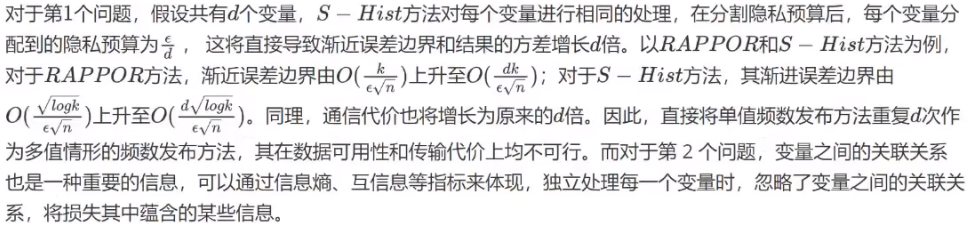
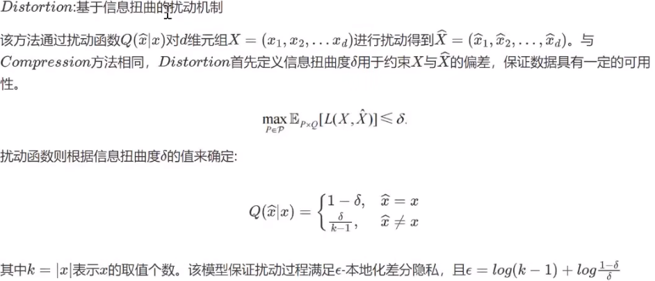

# 本地化差分隐私研究综述

# 一、摘要

- 个人敏感信息不被泄露受到重大挑战

- 隐私问题受到极大关注

- 中心化差分隐私保护技术需建立在可信**第三方数据收集者**的假设基础上，现实中不一定成立

- 本地化差分隐私作为一种新的隐私保护模型被提出，有如下特点：

  - 具有强隐私保护性，不仅可以抵御具有任意背景知识的攻击者，而且能够防止来自不可信第三方的隐私攻击

  - 对敏感信息提供了更全面的保护

- 本文内容

  - 介绍本地化差分隐私的原理与特性

  - 总结和归纳该技术的当前研究工作

  - 重点阐述该技术的研究热点：本地化差分隐私下的**频数统计、均值统计**以及满足本地化差分隐私的**扰动机制设计**

  - 对已有技术深入对比，并指出本地化差分隐私保护技术的未来研究挑战

# 二、介绍

## （一）关于隐私保护的相关法案：

2016.4欧盟《一般数据法案》

2017.6中国《中华人民共和国网络安全法》、《最高人民法院、检察院关于办理侵犯公民个人信息刑事案件是用法律若干问题的解释》

## （二）隐私保护模型：

- k-匿名
- l-多样性
- t-紧密型
- 差分隐私：严格定义了隐私保护的强度，即任意一条记录的添加或删除，都不会影响最终的查询结果；同时定义了严格的攻击模型，其不关心攻击者具有多少背景知识。

## （三）中心化差分隐私与本地差分隐私对比

中心化差分隐私：将原始数据集中到一个数据中心，然后发布满足差分隐私的相关统计信息。因此，中心化差分隐私对于敏感信息的保护始终基于一个前提假设：可信的第三方数据收集者，即保证第三方数据收集者不会窃取或泄露用户的敏感信息。（这一前提假设难以保障）

本地化差分隐私：在继承中心化差分隐私技术定来呢规划定义隐私攻击的基础上，细化了对个人敏感信息的保护。其将数据的隐私化处理过程转移到每个用户上，使用户能够单独地处理和保护个人敏感信息，即进行更加彻底的隐私保护（本地化扰动数据）

## （四）本地化差分隐私应用场景

众包数据采集：

通过众包的方式进行数据采集是一种新的数据采集方式

用户参与众包数据采集时，不可避免地存在泄露个人敏感信息的风险（eg：语音信息可能泄露个人身份特征信息）

K-匿名方法对众包数据进行隐私保护（doi：10.1109/TKDE.2013.93）

基于编码扰动方法对众包数据进行隐私保护（doi:10.1109/ITA.2014.6804213）

**上述两种方法都未考虑基于背景知识的攻击。**

敏感图像特征提取：

人脸、指纹、虹膜图像等生物特征数据可唯一精确定位到个人；医学造影图像蕴含个人相关疾病信息。直接对蕴含敏感信息的图像进行存储和分析，可能泄露隐私，故对此类图像的存储和分析过程进行相应的隐私保护是必要的

多方安全计算（secure multiparty computation）可在人脸识别过程中进行隐私保护

基于云计算环境，图像特征提取过程中基于加密的隐私保护算法（doi：10.1145/2647968.2654941）

**现有方法均建立在可信的数据收集者基础上**

本地差分隐私研究与应用需要考虑的问题：

如何设计满足ε-本地差分隐私的数据扰动算法，以保护其中的敏感信息

数据收集者如何对查询结果进行求精处理，以提高统计结果的可用性

## （五）文章结构

第一节：介绍本地化差分隐私保护技术的基础知识

第二节：介绍相关数据保护框架

第三、四节：对本地化差分隐私保护技术的当前研究方向进行概括，并对研究方法进行对比

第五节：提出本地化差分隐私保护技术的研究挑战

第六节：总结全文

# 三、基础知识

## 3.1 本地化差分隐私定义

定义1：给定n个用户，每个用户对应一条记录，给定一个隐私算法M及其定义域Dom（M）和值域Ran(M)，若算法M在任意两条记录t和t’（t,t’∈Dom（M））上得到相同的输出结果t* ( t*⊆Ran(M))满足以下不等式，则M满足ε-本地差分隐私

$$
Pr[M(t)=t^*]≤e^ε×Pr[M(t’)=t^*]
$$
根据该定义可看到：**根据隐私算法M的某个输出结果，几乎无法推理出其输入数据为哪一条记录。**

## **3.2 扰动机制**

目前，随机响应（randomized response）技术是本地化差分隐私保护技术的主流扰动机制，本节主要对其原理进行阐述。

### 3.2.1随机响应技术

由Warner于1965年提出利用随机响应技术进行隐私保护，称其为W-RR，主要思想是**利用对敏感数据问题响应的不确定性对原始数据进行隐私保护。**

随机响应技术主要包括两个步骤：**扰动性统计**和**矫正**。

场景描述：

假设有 n 个用户,其中艾滋病患者的真实比例为π,但我们并不知道.我们希望对其比例π进行统计.于是发起一个敏感的问题:“你是否为艾滋病患者?”,每个用户对此进行响应,第 i 个用户的答案 Xi 为是或否,但出于隐私性考虑,用户不会直接响应真实答案.假设其借助于一枚非均匀的硬币来给出答案,其正面向上的概率为 p,反面向上的概率为1-p.抛出该硬币,若正面向上,则回答真实答案,反面向上,则回答相反的答案.

扰动性统计

利用扰动方法对n个用户的回答进行统计，可以得到艾滋病患者人数的统计值。假设统计结果中，回答“是”的人数为n1，则回答“否”的人数为n-n1。显然，按照上述统计，回答“是”和“否”的用户比例如下：

显然，上述统计比列并非真实比例的无偏估计

**校正**

构建以下似然函数：

得到π的极大似然估计：

计算过程如下：

**证明π为无偏估计：**

由此可以得到校正的统计值。其中，N表示统计得到的艾滋病人数估计值：

综上，根据总人数n、回答“是”的人数n1和扰动概率p，即可得到真实患病人数的统计值。为保证其满足ε-本地化差分隐私，根据定义，隐私预算ε设定为：

 

### 3.2.2离散型数据的随机响应

W-RR仅对包含两种取值的离散型数据进行响应，而对于具有超过两种取值的数据并不适用。转化思路有以下两点：

对变量的不同取值进行编码与转化，使其满足W-RR技术对二值变量的要求

对于k个候选值，将每一个候选值都编码成长度为[logk]的0/1串，然后对0/1串的每一位上的0/1进行随机响应。

不足：logk并非刚好取整，因此存在某些0/1串未能匹配到相应候选值的情形，由此造成的匹配失误以及随即响应技术本身的扰动误差，将使得数据发布的可用性降低。

技术难点：在于属性候选值的编码和匹配策略。

基于此技术的算法包括：**RAPPOR**，**S-Hist**等

- 改进W-RR技术，使其能够直接适用于超过两种取值的变量，假设变量x总共包括k种不同的取值，其取值集合S=x1，x2...，xk，我们称集合S为x的候选值集合

W-RR中将概率分配到变量的两种取值上。而对于K种取值的情况，需要保证概率的分布能够覆盖到k种取值的任意一种。基于该思想，本地化差分隐私情况下，离散型数据的随机响应方法包括**k-RR**和**O-RR**

### 3.2.3连续型数据的随即响应(可以直接加噪声吗？)

主要思想：将连续性数据离散化，然后利用离散型数据下的随机响应方法，对数据进行扰动。目前已有的方法一般是连续性数据离散化为某两个数值，然后再实用W-RR

基于上述思路，本地化差分隐私情况下，连续型数据的随机响应放发包括**MeanEst**和**Harmony-mean**等

## 3.3本地化与中心化差分隐私异同点

本地化差分隐私保护技术是在中心化差分隐私保护技术的基础上提出来的，其继承了中心化差分隐私保护技术上的组合特性。同时又对其进行了扩展，利用随机响应的扰动机制抵抗不可信的第三方数据收集者带来的隐私攻击。

**（1）组合特性**

差分隐私技术具有**序列组合性**和**并行组合型**两种

**序列组合性**强调隐私预算ε可以在方法的不同步骤进行分配；**并行组合性**保证满足差分隐私的算法在其数据集的不相交自己的隐私性。

形式化定义：

**（2）可信与不可信第三方**

中心化差分隐私中一个重要的假设是可信第三方数据收集者,每个用户将自己的真实数据记录发送给数 据收集者,并假定其是可信的,不会泄露个人的敏感信息.而后,数据收集者利用满足需求的隐私算法对数据分 析者的查询请求进行响应.本地化差分隐私中,其考虑的是第三方数据收集者不可信的场景,因此,将数据扰动 的功能从数据收集方转移到了客户端,即从数据收集者处转移到了每个用户处.每个用户按照隐私算法对数据 进行扰动,然后把数据上传给数据收集者,数据收集者接收数据分析者的查询请求,并进行响应.图 1(a)所示为中 心化差分隐私保护技术的数据处理框架,图1(b)所示为本地化差分隐私保护技术的数据处理框架. 

**（3）噪声机制**

中心化差分隐私保护技术中：为保证所设计的算法满足ε-差分隐私，需要噪声机制的接入，**拉普拉斯机制**和**指数机制**是其最常用的两种噪声机制,其中,拉普拉斯机制面向连续型数据的查询,而指数机制面向离散型数据的查询.上述两种噪声机制均与查询函数的全局敏感性密切相关,而全局敏感性则是定义在至多相差一条记录的近邻数据集之上,使得攻击者无法根据统计结果推测个体记录,即将个体记录隐藏在统计结果之中.

本地化差分隐私中：每个用户将各自的数据进行扰动后,再上传至数据收集者处,而任意两个用户之间并不知晓对方的数据记录,亦即,本地化差分隐私中并不存在全局敏感性的概念,因此,拉普拉斯机制和指数机制并不适用.目前,本地化差分隐私主要采用随即响应技术来确保隐私算法满足ε-本地化差分隐私

**（4）应用场景**

中心化差分隐私：

- 数据发布
- 数据分析
- 查询处理

本地化差分隐私：保护个人隐私不被数据收集中窃取或泄露

# 四、基于本地化差分隐私的数据保护框架

## 4.1中心化差分隐私保护框架

- 交互式：

当数据分析者提交相应的查询时，数据收集者根据查询请求，对**查询结果进行相应的隐私化处理**，如添加相应噪声，使其满足差分隐私要求。

- 非交互式：

数据收集者事先发布满足差分隐私的数据集相关统计信息，数据分析者提交查询后，直接从所发布的统计信息中返回相应的查询结果。

## 4.2 本地化差分隐私保护框架

- 交互式
- 非交互式

**综上：交互式和非交互式数据保护框架最大的在于输出结果之间的关联性**

# 五、主要研究方向

本地化差分隐私主要应用于统计数据库领域，研究方向见表1

由表 1 可知,本地化差分隐私技术的研究方向包括扰动机制的研究以及统计数据的发布.本地化差分隐私 的扰动机制主要包括**随机响应、信息压缩和扭曲**两种.随机响应技术的扰动框架简洁、直观,且其扰动程度可 直接量化,因此本地化差分隐私下的研究工作大都基于随机响应技术展开,包括针对离散型数据的频数发布和 针对连续型数据的均值发布.频数发布形式包括列联表、直方图等,其中,根据变量的数量不同分为单值频数发 布和多值频数发布.基于本地化差分隐私的单值频数发布主要是通过编码-解码技术以及概率扰动技术发布属 性候选值的频数来保护数据隐私,而多值频数发布则是在此基础上进一步利用采样技术和降维技术等提高了 数据的可用性.目前,针对本地化差分隐私的均值发布研究工作还较少,其主要思想一般是在无偏估计的前提下对连续值进行离散化. 

# 六、本地化差分隐私方法的对比与分析

根据算法的查询类型不同，可将其分为如下两类：

1.针对离散型数据的频数统计查询

2.针对连续性数据的均值统计查询

## 6.1基于本地化差分隐私的频数统计

频数发布是指针对离散型数据,返回给定约束条件下记录的数量,即计数查询的结果.中心化差分隐私保护 下相应的数据发布形式有：

- 列联表数据发布
- 针对二值型数据集的列计数数据发布
- 直方图数据发布
- 图数据发布

### 6.1.1 单值频数统计

单值频数统计指每个用户只发送一个变量取值的情况（比如年龄），用户将数据发送给数据收集者后，数据收集者根据已有或统计的候选值列表，统计其中每一个候选值的频数并进行发布。

#### 6.1.1.1 RAPPOR（Randomized Aggregatable Privacy-Preserving Ordinal Response）

在图3中代表年龄属性,其中存在某个取值xi=‘’45“,首先利用**Bloom Filter(布隆过滤器)**技术将其表示成一个长度为h的向量 {0,1}^h，同时记录下字符串与Bloom串的映射关系矩阵,然后利用随机响应技术对向量B的每一个  位进行扰动,得到**永久性随机响应(permanent randomized response,简称 PRR)结果B'**,其中,扰动的方式按照以下公式进行,f∈[0,1]表示概率取值: 

接着,再对向量B‘的每一个位进行第2次扰动,得到**瞬时性随机响应(instantaneous randomized response,简称IRR)结果S**,其中,第 2 次扰动的方式按照以下公式进行,其中,p∈[0,1]和q∈[0,1]分别表示B'i取值为1和0时置Si为1的概率: 

每个用户得到扰动结果S后,将其发送给第三方数据收集者,数据收集者统计每一位上1 出现的次数并进 行校正,然后结合**映射矩阵**,通过**Lasso回归**方法完成每个年龄值对应的频数统计. 

#### 6.1.1.2 S - Hist方法

S-Hist 方法对于频数统计的查询,其渐近误差边界为 ，S-Hist 方法的主要优点在于其极大地降低了通信代价,后续不少研究基于S-Hist方法进行改进并进行相关应用

#### 6.1.1.3  O - RAPPOR方法

#### 6.1.1.4 k - RR算法

目前，RAPPOR和k-RR为单值频数发布下的经典方法，下面从3个方面对此进行简单比较：

#### 6.1.1.5 O - RR 算法

#### 6.1.1.6  k - Subset算法

上述5种方法，均考虑扰动输出为单个取值的情况，我们称其为一对一扰动。

k - Subset方法适用一对多情形，如字符串的模糊匹配，对于指定的输入，输出的结果是一个集合定义如下：

当输出R'中仅包含一个元素,即d=1时,k-Subset方法将退化为k-RR算法,

#### 6.1.1.7 总结

表4对上述方法的主要优缺点、通信代价以及渐近误差边界和计算开销等进行了对比分析,其中,通信代价是指从每个用户处到数据收集方的数据传输的开销,这里我们近似认为通信代价与数据量成正比;渐近误差边界中,n 是指总用户数,k是指属性候选值个数,h表示Bloom Filter串的长度,c表示k-Subset方法中输出集合的大小;计算 开销是指数据收集者对用户数据进行统计时的计算代价,分为高、中、低这3个级别. 

从表4可以看出,基于RAPPOR方法的可用性较高,但同时也带来较高的计算开销;基于S-Hist的方法极大地降低了通信代价,但其计算开销与用户数正相关,用户多时,计算开销巨大,而采样过程也带来了一定的精度损失;基于k-RR的方法简化了数据扰动过程,同时也牺牲了一定的发布精度. 

### 6.1.2 多值频数统计

**多值频数统计是指每个用户发送多个变量取值的情形,**用户将数据发送给数据收集者后,数据收集者根据已有的或统计得到的候选值列表,统计其中每一个候选值的频数并进行发布.不同于单值频数统计问题,多值的情形需要考虑隐私预算的分割问题.直观地,可以将单值频数统计方法重复地用在多值情形中的每一个变量上, 但这样的话,将会出现以下两个问题:

   1.需要根据变量的数量分割隐私预算,当变量较多时,数据可用性急剧降低;

   2.忽略了变量之间的关联关系,损失了部分信息. 

#### 6.1.2.1 RAAPPOR - unknown方法

针对RAPPOR方法第2个方面的缺陷,即需要预先采集候选字符串列表,提出一种改进方法,用于多值频数统计,我们称该方法为RAPPOR-unknown.方法是基于RAPPOR方法来实现的,每个用户对数据的扰动 处理与RAPPOR 一致,但针对 RAPPOR 方法中数据收集者需要预先采集候选字符串列表这一缺陷,RAPPOR-  unknown 方法中基于 n-gram 思想,利用图 3 所示的用户端的数据扰动方式得到扰动结果后,从字符串中抽取r 个长度相同的子串,然后将扰动结果和子串的相关信息一起发送给第三方数据收集者,其中,数据的传输格式如下所示(n-gram即字符串的长度为n的子串): 

#### 6.1.2.2 Harmony - Frequency方法

#### 6.1.2.3 LDPMiner方法

LDPMiner是集值数据下的频数发布方法,其针对 Heavy hitter 查询.假设有 n 个用户,每个用户均包含 d 个项中的l个项,Heavy hitter集合大小为k.LDPMiner方法包括两个阶段:

​    1.数据收集者采集数据,确定Heavy  hitter 集合并将其返回给用户;

​    2.用户发送集合中k’个项所对应的数据.

方法的整体框架如图4所示. 

LDPMiner是基于RAPPOR和S-Hist方法实现的一个组合方法,考虑到每个用户需要发送多个数据项,通信代价较高,因此利用随机采样技术令每个用户只发送其中的一个数据项,然后利用RAPPOR方法和S-Hist方法来进行数据扰动,其中,把采样技术和 RAPPOR 方法的组合叫作sampling RAPPOR,而把采样技术和 S-Hist 方法的组合叫作sampling SH[20].如图4 所示,LDPMiner 方法包含以下两个阶段.

阶段1:sampling SH方法.用户 通过sampling SH方法将扰动后的数据发送给数据收集者,数据收集者统计每个数据项的频数,确定频数最高的 k'个项的集合,并将该集合返回给用户.

阶段2:sampling RAPPOR方法.用户通过sampling RAPPOR方法将阶段 1 返回的数据项所对应的数据再次发送给数据收集者,数据收集者统计每个数据项的频数,得到k'个数据项的频数.

LDPMiner 方法主要通过两个方面的数据处理来提高数据可用性: 

(1) 通过采样技术避免了隐私预算在不同数据项上的分割;

(2) 频繁项集合的确定和频数统计两个操作分离,缩小了需要扰动的数据项集合,从而增大了k'个数据项所分配到的隐私预算. 

#### 6.1.2.4 LoPub方法

LoPub结合了**RAPPOR方法**和**概率图模型**的多值频数统计方法.整体思路包括3个步骤:

(1) 用户端的 数据扰动;

(2) 数据收集者估计联合概率分布并进行数据降维;

(3) 合成数据集.

首先,每个用户通过RAPPOR 方 法对元组进行扰动后,将其发送给数据收集者,即利用Bloom Filter技术对数据集的每个属性的每个候选值进行 编码,然后将元组中d 个属性的候选值的编码串接在一起,利用随机响应技术对该串进行扰动,把得到的永久性 随机响应结果发送给数据收集者..随后,类似于文献[61]中基于中心化差分隐私的高维数据发布方法,数据收集 者对采集到的数据进行频数统计,进而构建出马尔可夫网络(Markov network),利用属性之间的关联性得到极大团(maximal clique),并将属性的联合概率分布以极大团的形式来表示,以此达到数据降维的目的.最后,通过联合概率分布重新合成一个数据集进行数据发布. 

6.1.2.5 总结

以上介绍了本地化差分隐私下的频数统计方法.表5对上述方法的主要优缺点、通信代价、渐近误差边界、 隐私预算的分配等进行了对比分析,其中,d 表示变量的个数,h 表示 Bloom Filter 串的长度,r 表示 RAPPOR - unknown 方法中子串的个数,m 表示 S-Hist 方法中字符串的编码长度,l表示 LoPub 方法中字符串的平均编码长度. 

## 6.2 基于本地化差分隐私的均值统计

本地化差分隐私下的均值统计,其主要思想是对个体值添加正向和负向的噪声,最终通过聚合大量的扰动结果以抵消其中的正负向噪声,从而使统计结果满足一定的可用性要求. 

###  6.2.1 MeanEst方法

### 6.2.2 Harmony — Mean方法

### 6.2.3 总结

以上介绍了本地化差分隐私下的均值统计方法.表6对上述方法的主要优缺点、通信代价、渐近误差边界 以及隐私预算的分配进行了对比分析.

## 6.3 基于信息压缩和扭曲的扰动机制

目前,随机响应是本地化差分隐私的主流扰动机制,上述频数统计和均值统计方法均基于此而实现.此外, 还有基于信息压缩和扭曲的扰动机制.为了完整阐述本地化差分隐私的研究现状,本节补充说明基于信息压缩 和扭曲的扰动机制. 

### 6.3.1 Compression

### 6.3.2 Distortion

### 6.3.3 总结

上述两种基于信息压缩和扭曲的扰动机制主要从信息损失的角度考虑输入和输出的关系,而基于随机响 应技术的扰动机制则主要以一定的概率分布衡量输入和输出的关系.表7对几种扰动机制进行了比较. 

从表7 可以看出,W-RR 模型由于其高度可扩展性成为了本地化差分隐私下主流的扰动机制.Compression 模型虽然对输入域进行了压缩,但是每个用户的传输代价并未减少,因此其通信代价很高.此外,Compression 仅 适用于低维的情况,主要是因为输入与输出之间的匹配需计算笛卡尔乘积,当维度较高时,得到的匹配结果将呈 指数式增长,将使得相应的时空复杂度过高.类似地,在 Distortion 模型中,隐私预算的设置依赖于属性候选值的 个数,且随候选值个数的增加而增加,因此,当属性候选值个数较多时,隐私保护程度将有所下降. 

# 七、本地化差分隐私技术的实验特性分析

# 八、未来挑战

目前,本地化差分隐私还是一个新的研究领域,现有研究主要集中在两个方面:

​    1.理论上,设计满足本地化 差分隐私的保护机制;

​    2.方法上,对频数和均值两种统计结果进行保护.

然而,大数据时代下,数据的复杂性、多样性和大规模性等特性将带来新的大数据隐私风险.因此,结合现有研究,我们认为本地化差分隐私保护技术 还有很多挑战性问题亟待解决,以下从3个方面进行阐述. 

## 8.1 复杂数据类型的本地化差分隐私保护

  1.键值对

键值对是一种常用的数据类型,中心化差分隐私技术对键值对数据的隐私保护,其思想一般是将相同 “键”所对应的“值”进行统计,并添加噪声.然而实际上,我们认为,在本地化差分隐私场景下,除了“值”,“键”本身 也具有一定的敏感性,因为数据收集者可能通过“键”重新定位某个用户,从而获取敏感信息.因此,对于键值对数 据,需要同时对“键”和“值”进行隐私化处理,且仍需保证“键”和“值”之间的对应性. 

  2.图数据

图数据则是一种更为复杂的数据类型,其根据图结构定义了节点、边和属性,存储相应信息.例如,社交网络 数据、路网数据等.中心化差分隐私技术针对图数据的隐私保护,包括子图计数、节点数据发布等,其主要 难点在于图的结构特点使得查询的全局敏感性极高,从而使得噪声过大.基于本地化差分隐私技术的图数据发 布,虽然不存在敏感性过大的问题,但是由于每个用户对数据的扰动过程相互独立,数据收集者如何根据扰动后 的数据构建可用性高的图结构,即如何保证原始数据之间的关联性是一大挑战.况且,现实中很多图数据是稀疏 的,这进一步加大了还原数据关联性的难度. 

## 8.2 不同查询和分析任务的本地化差分隐私保护

针对不同查询和分析任务的本地化差分隐私保护技术主要考虑以下3个方面的问题.  

(1) 提供对除计数查询和均值查询以外的多种查询方式的支持;  

(2) 数据扰动方式与查询类型的解绑,使得扰动后的数据能够同时支持多种查询; 

(3) 提高数据分析结果的可用性.

## 8.3 基于本地化差分隐私的高维数据分布

本地化差分隐私下的高维数据发布主要考虑 3 个方面的问题:

(1) 如何在一定隐私预 算内衡量属性之间的关联性,从而进行降维处理;

(2) 如何设计推理模型,最小化边缘分布到联合分布的近似误 差,提高数据可用性;

(3) 如何控制高维数据在用户和数据收集者之间的通信代价.

# 九、结束语

大数据时代个人数据高度敏感,如何防止隐私信息泄露是当前面临的重大挑战.本地化差分隐私是继中心 化差分隐私后新兴的隐私保护模型,其打破了中心化差分隐私中关于可信第三方数据收集者的假设,在用户端 对数据进行隐私化处理.目前,本地化差分隐私保护技术是隐私保护领域的研究热点,本文对其研究成果进行总 结和分析,综述了本地化差分隐私保护技术的研究现状,总结该技术在频数统计和均值统计中的应用,并进行实 验特性分析.最后,本文就现有研究工作和现实需求进行探讨,结合二者提出未来研究挑战.总之,本地化差分隐 私保护技术还是一个新兴研究领域,仍有诸多关键问题需要进行深入而细致的研究.
